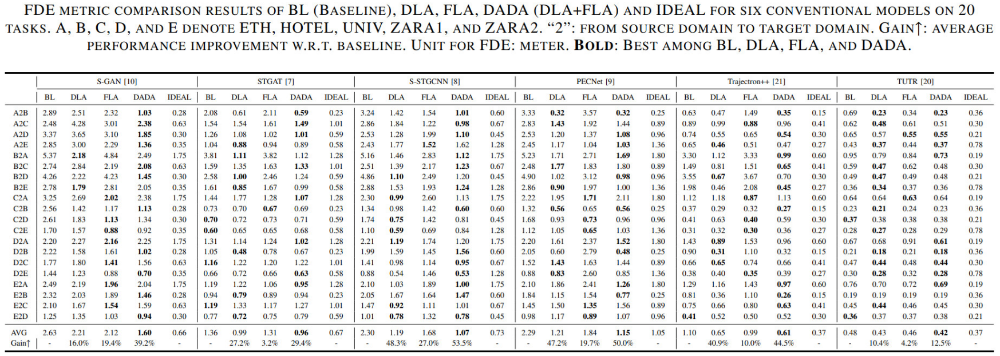

<div align="center">
<h1>DADA</h1>
<h3>Dual-Alignment Domain Adaptation for Pedestrian Trajectory Prediction</h3>
</div>

<div align="center">
  
</div><br/>

## News
- `[2024/08/10]` arxiv paper release.

## Setup
**Environment**
<br>All models were trained and tested on Ubuntu 18.04 with Python 3.8.17 and PyTorch 2.0.1 with CUDA 11.8.
You can start by creating a conda virtual environment:
```
conda create -n dada python=3.8 -y
source activate dada
pip install -r requirements.txt
```

**Dataset**
<br>Preprocessed [ETH](https://data.vision.ee.ethz.ch/cvl/aem/ewap_dataset_full.tgz) and [UCY](https://graphics.cs.ucy.ac.cy/research/downloads/crowd-data) datasets are included in this repository, under `./datasets/`.  
Among these datasets, `train_origin`, `val` and `test` are obtained directly from the ETH and UCY datasets, and `train` is obtained after the DLA processing.
<br>We have provided an example `A2B` in `./datasets/A2B/`, which demonstrates how to set up the dataset for a particular cross-domain task. If you want to construct another `S2T` dataset, please follow the step below (here use `B2C` dataset as an example):
- create a folder named `B2C` under `./datasets/`;
- create four folders named `train_origin`, `train`, `val` and `test` under `./datasets/B2C/`;
- put the B-domain (HOTEL) training set into new-created `train_origin` and `train` folders; put the C-domain (UNIV) validation set into `val` folder; put the C-domain testing set into `test` folder;
- train the corresponding DLA model to automatically generate the aligned source data in `train` folder.

**Baseline Models**
<br>This repository supports three baseline models: [Social-GAN](https://github.com/agrimgupta92/sgan), [Trajectron++](https://github.com/StanfordASL/Trajectron-plus-plus) and [TUTR](https://github.com/lssiair/TUTR). 
Their DADA-modified source code are in `./models/`.

## Quick Start
To train and evaluate our DADA-model on the A2B task at once, we provide a bash script `train.sh` for a simplified execution.
```
bash ./train_DADA.sh -b <baseline_model>  # quickly train
bash ./test_DADA.sh -b <baseline_model>  # quickly evaluate
```
where <baseline_model> could be `sgan`, `trajectron++` or `tutr`.  
For example:
```
bash ./train_DADA.sh -b sgan  # quickly train
bash ./test_DADA.sh -b sgan  # quickly evaluate
```
## Detailed Training
### Training for DLA
The DLA network could to be trained by: 
```
cd ./DLA/
python train_DLA.py  --subset <task_S2T>
```
For example:
```
python train_DLA.py  --subset A2B
```
After finishing training, the aligned source data will be automatically generated in `./datasets/subset/train/`.

### Training for Prediction Models
Given that our repository supports three baseline models, here we take the Social-GAN as example.

**Training for Baseline**
<br>The baseline model is directly trained without DLA data:
```
cd ./models/sgan/scripts/
python train.py --dataset_name <task_S2T>
```

**Training for DLA**
<br>The DLA model is trained with DLA data, so you just need to modify the [train_set path](models/sgan/scripts/train.py#L121) to `f'../../../datasets/{args.dataset_name}/train'` and modify the [checkpoint_save path](models/sgan/scripts/train.py#L591) to `'../checkpoint/checkpoint_DLA'`.

**Training for DADA**
<br>The DADA model is further embedded an discriminator w.r.t DLA model during training phase:
```
cd ./models/sgan/scripts/
python train_DADA.py --dataset_name <task_S2T>
```
You can find the code of the [discriminator structure](models/sgan/sgan/models.py#L639) and its [training procedure](models/sgan/scripts/train_DADA.py#L485).

## Detailed Evaluation
Given that our repository supports three baseline models, here we take the Social-GAN as example.

**Pretrained Models**
<br>We have included pre-trained models in `./models/sgan/checkpoint/` folder that can be directly used to evaluate models.

You can simply view the DADA evaluation result for A2B task by running:
```
cd ./models/sgan/scripts/
python evaluate_model.py --dataset_name <task_S2T>
```
To view the baseline and DLA evaluation result, you just need to modify the [checkpoint_load path](models/sgan/scripts/evaluate_model.py#L125).

## Experimental results

### ADE results
<div align="center">
  
</div><br/>

### FDE results
<div align="center">
  
</div><br/>

### visualization
<div align="center">
  
</div><br/>
